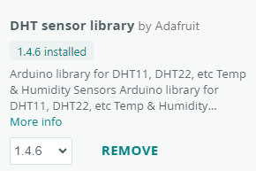
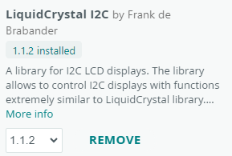
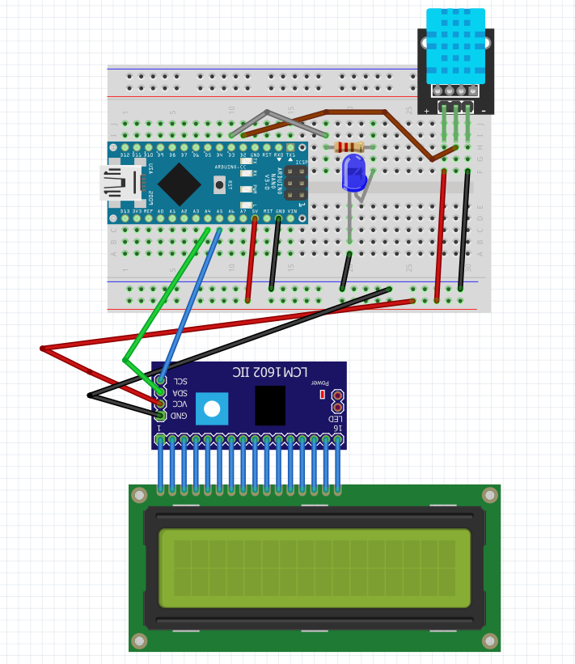

# DHT Sensor Displaying Data on LCD (I2C) Screen

Simple DHT sensor which displays data on an LCD (I2C interfaced) screen.

## Used Board

**ESP32** microcontrollers.  
Intall `esp32` boards from **Boards Manager**.

### My Board
`NodeMCU ESP-32S` (`NodeMCU-32S` in Board selection menu).

## Used libraries
- `DHT sensor library` _by Adafruit_ - Sketch → Include Library → Manage Libraries… (`Ctrl+Shift+I`)  

- `LiquidCrystal I2C` _by Frank de Brabander_ - Sketch → Include Library → Manage Libraries… (`Ctrl+Shift+I`)  

- The rest of the libraries are built in

## Schematic and Microcontroller Image

---

Installed libraries on Windows are located in `Documents\Arduino\libraries` directory.